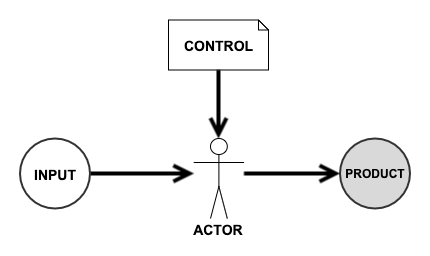
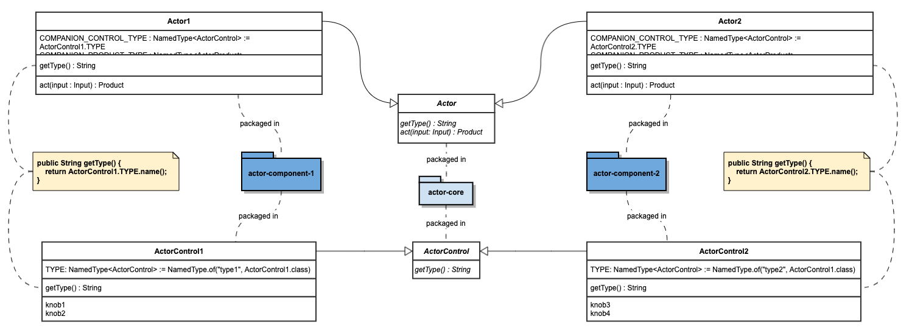

# An extensible component structure build around { CONTROL, ACTOR, PRODUCT }

## The Basic Idea  
Weave has an extensible component structure based on an idea distilled from a common practice in software engineering, 
config, which is widely adopted either intuitively or intentionally, when software engineers write codes at different 
levels methods/functions, classes, components and build applications and complex systems. The distilled idea consists 
of three parts,

- CONTROL, controls the behavior of ACTOR 
- ACTOR, acts upon CONTROL, processes input and produces PRODUCT  
- PRODUCT, produced by ACTOR  

To read the idea in context of method,  
- control parameter, controls the behavior of method, 
- method, processes input and may or may not produce a return
- return, produced by method

Similarly, to read the idea in context of application,
- config, controls configurable part of behavior of entire application
- application, does processing as instructed by configuration
- yield, typically application generates something

## The Component Structure

### Actor Core
 

For every concept, 
- define ActorControl using interface or abstract class
- define Actor using interface or abstract class
- package them without any implementation included in the same package

### Actor Component

For every component which extends/implements core concept,
- extend/implement ActorControl
- extend/implement Actor
- bind implementations of ActorControl and Actor by ActorImpl.COMPANION_CONTROL_TYPE
- package compiled component together with extension meta-info, which is important.  

## The Challenges

(**Feel free to skip The Challenges part**, but it's highly recommended to read through the rationales behind the general component structure.)

While conceptually the idea mentioned above is very simple to understand, to build an extensible component structure based on it is a different story. There are several challenge points need to be tackled.
 
### 1.Separate control and actor  

The idea of control is to make actor easy to change in some cases, because the lifecycle of control is different from 
that of actor. To really achieve that, separation between control and actor is needed. However, that's not something 
 guaranteed without discipline. Separation happens at different levels,  
 * separate code of control from code of actor
 * separate persisted form of control from code of control and code actor
 * externalize persisted form of control from package of control and actor in compiled binary  
 
Applications fails at any of these three levels with regard of separation of control and actor will exhibit some level 
of difficulty to change and adapt. For example, when control is not externalized, means it's packaged together with 
compiled code, even a smallest change in one parameter in a control will need full development/test/deploy cycle.

### 2.Separate concept from implementations

The idea of concept and implementation is well understood, however why/how to separate concept from implementation is 
not fully understand and grasped by every engineer. Separating concept from implementation happens at 2 levels,
* separate the code representing concept and the code representing implementation. Programming languages like Java gives
good structures for this, interface/abstract class are for concept while concrete class is for implementation. 
* separate the package of compiled binary for concept and the package of compiled binary for implementation.
In case of {CONTROL, ACTOR, PRODUCT}, both two levels of separations between concept and implementation is needed to 
fully achieve extensibility of application built on a set of {CONTROL, ACTOR, PRODUCT}. Otherwise, the system is still
somewhat rigid for change.

### 3.Separate among implementations
Separation among implementations is equally important as separating concept from implementations. Reason is different implementations often have different paces of change. It's not a good idea to bundle too many implementations together.

### 4.Bind control, actor and product without knowing implementations upfront
After proper separations are achieved, the problem comes to how and when to bind them. Fortunately, many good examples are out there for reference. It's completely doable to create a micro-framework has the capability to do deferred binding between {control, actor, product} and its implementations, and between control and actor of an implementation.

### 5.Representation form of control
In point 1, it's mention that the third level of separation of control and actor is to externalize persisted form of control, meaning control as configuration is maintained out side of actor binary package. It's not a big problem. However, care must be taken to choose the representation form for control with unknown set of varieties. For example, an application needs to connect to Cassandra cluster and also Couchbase cluster. At high level both involve connection parameters, such as server list, ports, etc. But looking into details, they are very different. 
Externalized representation needs to 
* be able to capture the difference in varieties of controls
* meanwhile also be able to make it easier to convert representation into something easier for actor to consume at runtime
As you might have already noticed, JSON/Yaml are very popular for externalized configuration. There are many good reasons, but IMHO, they are popular because they meets two requirements above.

