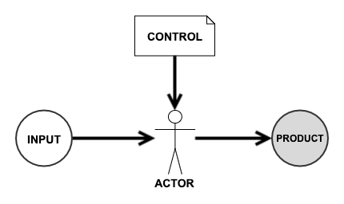
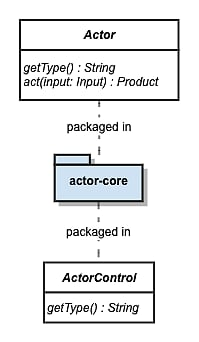
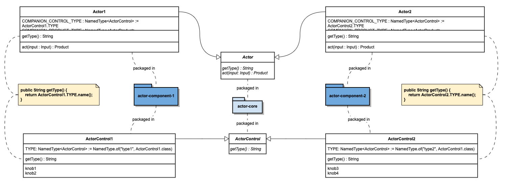
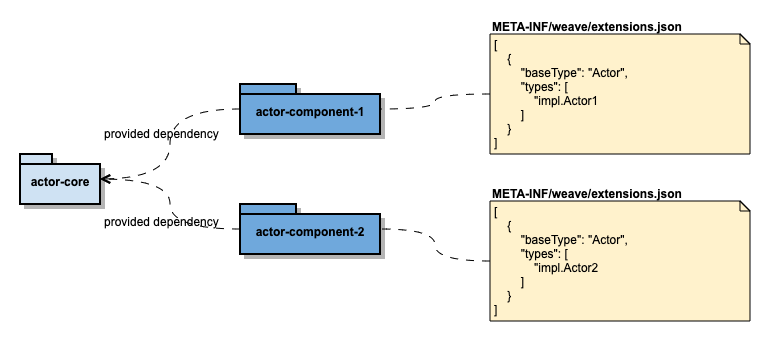
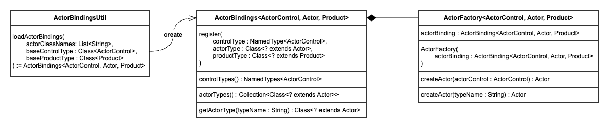
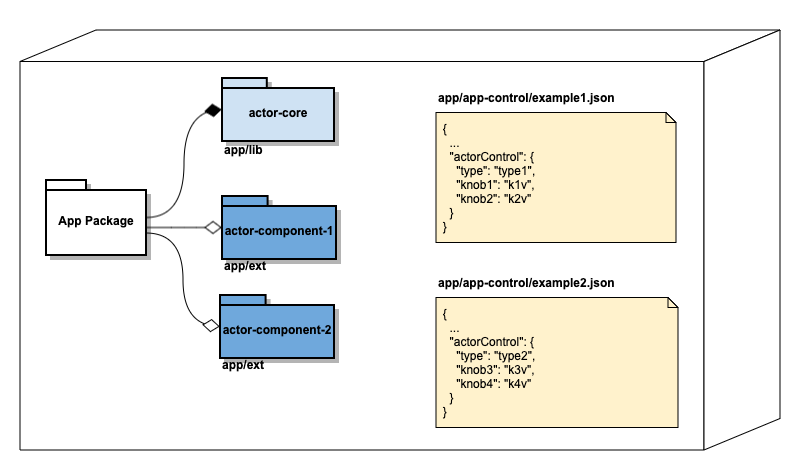

# An extensible component structure built around { CONTROL, ACTOR, PRODUCT }

## The Basic Idea  
Weave has an extensible component structure based on an idea distilled from a common practice in software engineering, **config**, which is widely adopted in methods/functions, classes, components, applications and complex distributed systems. Software engineers either intuitively or intentionally introduce configuration when writing code. The distilled idea consists 
of three parts,

- CONTROL, controls the behavior of ACTOR 
- ACTOR, acts upon CONTROL, processes input and produces PRODUCT  
- PRODUCT, produced by ACTOR  

To read it in context of method,  
- control parameter, controls the behavior of method, 
- method, processes input and produce a return
- return, produced by method

Similarly, to read it in context of application,
- config, controls configurable part of behavior of entire application
- application, does processing as instructed by configuration
- yield, typically application generates something

## The Component Structure and the Micro-framework

### Actor Core
 

For every conceptual actor, 
- define ActorControl using interface or abstract class
- define Actor using interface or abstract class
- package them without any implementation included in the same package

### Actor Component

For every component which wants to implement core concept,
- extend/implement ActorControl
- extend/implement Actor
- bind implementations of ActorControl and Actor by ActorImpl.COMPANION_CONTROL_TYPE
- package compiled component together with extension meta-info, which is important

### Actor Binding Facility

 

As long as application runtime can see packages of Actor Components, it can discover and weave the bindings using the facility as depicted in above diagram.

### Application built around {CONTROL,ACTOR,PRODUCT}

For application whose core is built around a set of {CONTROL,ACTOR,PRODUCT}, its component structure makes the application highly extensible and configurable to the level of declarative.  

- on installation of a package contains actor component, available types of ActorControl, Actor and Product can be discovered via packaged extensions meta-info and get registered.
- on uninstallation of a package contains actor component, corresponding types get unregistered.
- application level control/config will naturally consist of controls for registered actors. Once application sees a application control, it knows which types of actors are involved and how to get actor instances. Interaction among app-core and actor instances and inter-actor-instances is straightforward, because each actor instance knows exactly how to act in according to control matters to itself.

## The Rationale

(**Feel free to skip this part**, but it's highly recommended to go through the reasoning part behind the general component structure.)

While conceptually the idea mentioned above is very simple to understand, to build an extensible component structure based on it is a different story. There are several points need to be tackled.
 
### 1.Separate control and actor  

The idea of control is to make actor easy to change when needed. Because the lifecycle of control is different from 
that of actor, separation between control and actor (to decouple the two) is needed to make change through control possible. However, that's not something guaranteed without discipline. Separation needs to happen at different levels,  
 * separate code of control from code of actor
 * separate persisted form of control from code of control and code actor
 * externalize persisted form of control from package of compiled control and actor  
 
Applications fails at any of these three levels with regard of separation of control and actor will exhibit some level 
of difficulty to change and adapt. For example, when control is not externalized, means it's packaged together with 
compiled code, even a smallest change in one control parameter will need full development/test/deploy cycle.

### 2.Separate concept from implementations

The idea of separating concept and implementation is well understood, however why/how to separate concept from implementation is not fully understood and grasped by all engineers. Separating concept from implementation happens at 2 levels,
* separate the code representing concept and the code representing implementation. Programming languages like Java gives
good structures for this, interface/abstract class are for concept while concrete class is for implementation. 
* separate the package of compiled binary for concept and the package of compiled binary for implementation.  

In case of {CONTROL, ACTOR, PRODUCT}, both two levels of separation are needed to fully achieve extensibility of application built on a set of {CONTROL, ACTOR, PRODUCT}. Otherwise, the system is still somewhat rigid for change.

### 3.Separate among implementations

Separation among implementations is equally important as separating concept from implementations. Reason is different implementations often have different paces of change. It's not a good idea to bundle too many implementations together.

### 4.Bind control, actor and product without knowing implementations upfront

After proper separation is achieved, the question comes to how and when to bind them. Fortunately, many good examples are out there for reference. It's completely doable to create a micro-framework which has the capability to do deferred binding between {control, actor, product} and its implementations, and between control and actor of an implementation.

### 5.Representation form of control

In point 1, it's mentioned that the third level of separation of control and actor is to externalize persisted form of control, meaning control as configuration is maintained out side of actor binary package. It's easy to do. However, special care must be taken to choose the representation form for control, which has unknown set of varieties. For example, an application needs to connect to Cassandra cluster and also Couchbase cluster. At high level both are about creating client connectiions, involving connection parameters, such as server list, ports, etc. But looking closer, connection parameters are very different. 
Externalized representation needs to 
* be able to capture the difference in varieties of controls
* meanwhile also be able to make it easier to convert representation into something easier for actor to consume at runtime  

You might suggest to use JSON/Yaml. Yes, they are very popular for externalized control/configuration. There are many good reasons, but IMO, the main reason is JSON/Yaml meets above two mentioned requirements.

## Summary
The component structure and the micro-framework implemented in Weave has following characteristics,  

- complete separation between concept core and concrete components
- complete separation between control and actor of every concrete component
- completely externalized control from component package and application package
- as long as the contract established by each actor core remains same, concrete component, its package, and externalized control for actor can evolve separately at own pace and their lifecycles can be managed separately.
