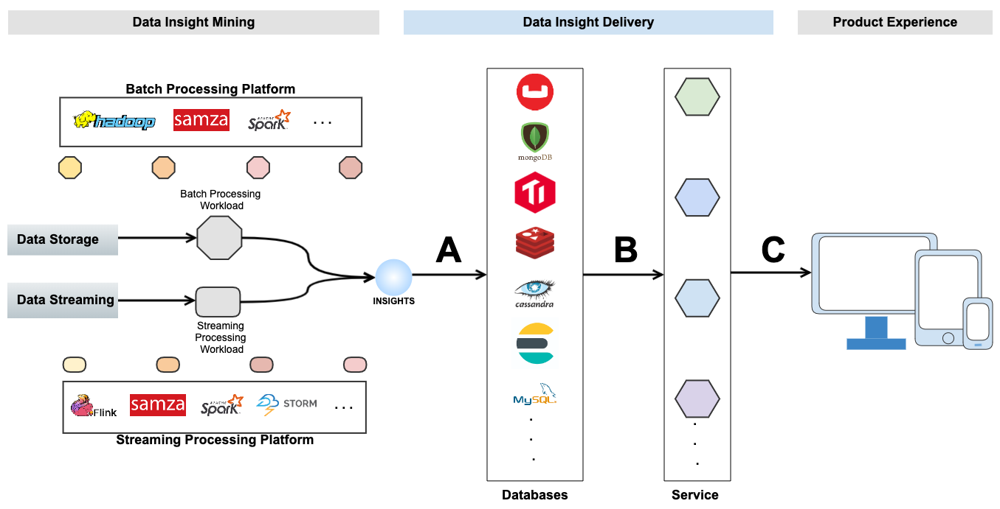

# Deliver Data Insights to Product Experiences at Scale

This article is about solution that delivers data insights to product experiences, the focuses are A and B and C in 
diagram below.

## The gap

If you work in data area, the left part of the diagram above, Data Insight Mining, might look familiar. If you 
work on Product Experience, the right part should be obvious.  

Question is how to make it happen when product experience needs data insight? Can product experience directly use data 
insight from data processing pipeline?
 
More often than not, such data insight just right off data processing pipeline cannot be directly used by product 
experience. Reasons are

1. product experiences often want different views hence have different access patterns of the same data insight
2. product experiences often have strict requirement on latency

So, there is still some gap between generated data insight and product experience. To cover it, significant amount of 
engineering time/effort is needed. 

## The common approach

To fill the gap, 

- A. certain type(s) of databases is selected based on view/access pattern/latency requirement, some data loader is 
created to load data insights into selected database, the model of data in target database is optimized for serving.

- B. service is preferred, so some service is built, which reads data from database.

- C. service does some lightweight transformation to produce views favored by product experience.

## The Practices and associated issues

The approach is simple and clear on the surface. But there are many issues when time comes to implementations and 
practices. Among all, the biggest one is **purpose-built solution**. The dynamics between data teams and product 
experience teams and the mindset at each end often play a big part in creating **purpose-built solutions**.

On one hand, product experience team' focal point is products, which are usually domain/experience specific. If it's 
one product experience team to build a solution or that product experience team has a big say in the solution in case 
some other team does that, the created solution is often only for that specific product experience. 
 - Data model early optimization gets its way into data insight (that fresh off the pipeline), sometimes even sneaks 
 into data processing workload. 
 - Data loader/service interface/service implementation are often tailored only for that experience. 
 - The possibility that the data insight might have a wider spectrum of use cases is not in the consideration of 
 product experience team. When a new use case of the same data insight arises in different product domain, the built 
 solution is found to be unfit, which is not rare to see.

On the other hand, data team's focus is to mine data insights by applying data science and engineering techniques and 
operating data processing workload and pipelines, etc. Their work is often data set specific and very detail-oriented. 
Such work has too much of their attention and unnoticeably shapes their mindset of approaching problems. When it comes 
to build something about delivering data insight to product experience, data team also tend to create purpose-built 
solution for each use case.

The problems associated purpose-built solution are  

- hard to change
- costly to operate, especially when too many purpose-built data loaders and services are there
- lack of engineering consistency
- impede in-team/cross-teams efficiency and effectiveness
- limit the value of data insight, exhibited as what's realized is smaller than potential

## Ideally

Data teams should be encouraged to look at data insights with holistic and end-to-end view, and to expand/extend their 
boundary closer to product experiences.

When there is a great solution for delivering data insights to product experiences, which 

- enforces engineering consistency
- is functionally rich
- is easy and quick to build and operate data loading jobs and data services

For data teams, they could remain their focuses on mining data insights, maximize the value of data insights by 
supporting as many use-cases as possible from product experiences without spending too much effort in building and 
operating insight delivery data loaders and data services.

For product experience teams, they could still get the data insights, but in much faster paces, while still enjoy data 
view, access patterns, latency which are specific to product experience in specific domain.

## The Weave Solution 

Weave is set to become such a solution to scale data teams and product experience teams by boosting engineering 
consistency, efficiency and effectiveness with regard to insight delivery.

- it fully adopts and embraces a well-thought 
[CAP component structure](https://aftersound.github.io/weave/control-actor-product-component-structure), which enforces
great engineering consistency and makes extensions possible and simple.

- its batch framework, built on top of CAP, provides the capability of declaratively creating data loaders at runtime.

- its [service framework](https://aftersound.github.io/weave/micro-service-virtualization-over-cap-closer-look), also 
built on top of CAP, offers building and operating virtualized data services through service metadata.

## About Weave

[Weave](https://github.com/aftersound/weave) is a Java-based declarative service/batch framework targeting data area. 

It's open source and still in early phase. All contributions are welcome.

 
 
