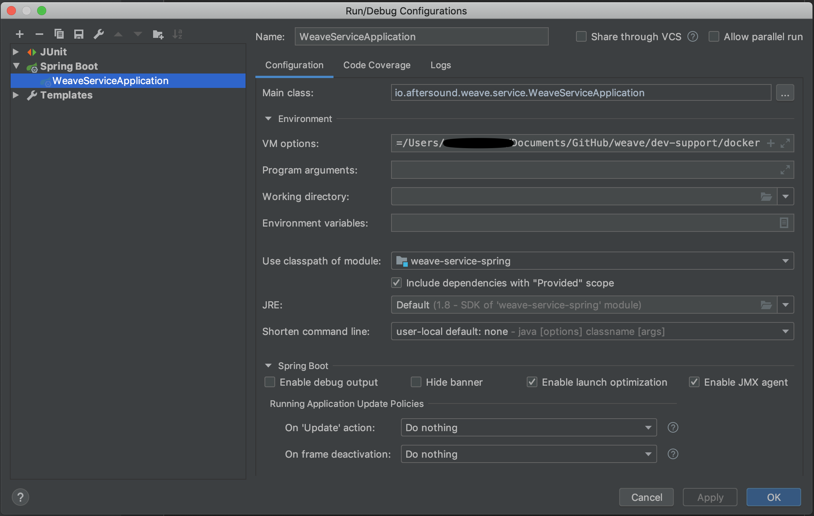
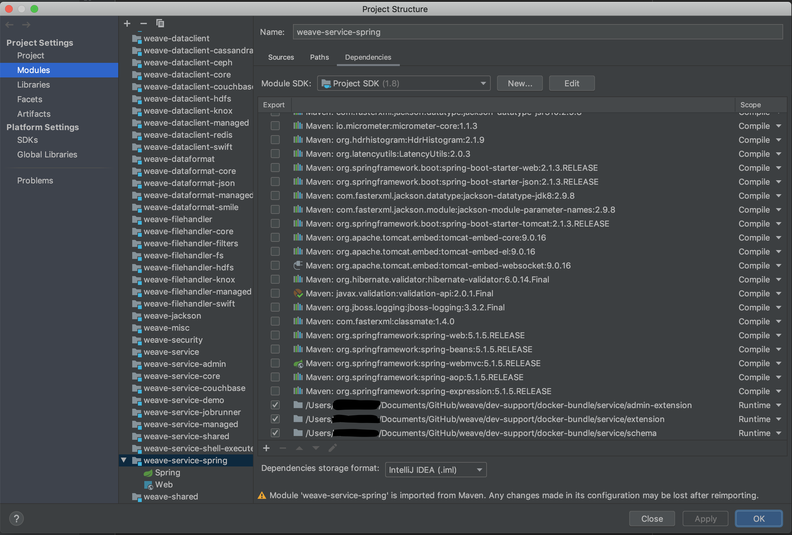

# Quick guide on how to do development in IDE

## Set up Sonatype Nexus Repository Server
A Sonatype Nexus repository server is needed for extension components. Follow the description of [sonatype/nexus](https://hub.docker.com/r/sonatype/nexus)
to start a docker container. Once starts, log into nexus web console to allow anonymous write.

## git fork/clone
- fork the repository, if you want to contribute, then clone from your own fork.
- or else simply clone https://github.com/aftersound/weave

## IntelliJ

1. Open parent pom.xml under weave clone as a project

2. mvn clean compile package install deploy  
    * Built package will be deployed into Nexus repository.  
    * If you see some unit test failure, you could disable tests 
    for a while. 

3. Create run configuration like below  
    
    * VM Options: -DWEAVE_HOME=WEAVE_LOCAL_REPOSITORY/dev-support/docker-bundle
4. Add external dependencies  
Open Module Settings -> Modules -> weave-service-spring -> Dependencies -> + JARS or Directory
     
    
5. try Debug "WeaveServiceSpring", depends on the what's in docker-bundle, you may or may not see exceptions in console.