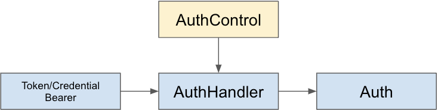

# Weave Extension Point - AuthHandler

## Quick Overview

### Definition

{ AuthControl, AuthHandler, Auth }

### Diagram



### Extension Category Group Name

SERVICE_AUTH_HANDLER

### META-INF Template

META-INF/weave/authenticator-extensions.json

```json
{
  "group": "SERVICE_AUTH_HANDLER",
  "baseType": "io.aftersound.weave.security.AuthHandler",
  "types": [
    "implementation class name of io.aftersound.weave.security.AuthHandler"
  ]
}
```

### Applicable Scope

- service

### Description

This extension point allows new authentication and authorization mechanism to be added for service. 

- AuthControl, instructions on how authentication/authorization should be conducted
- AuthHandler, acts on AuthControl to authenticate and/or authorize given token/credential bearer
- Auth, the result of authentication and/or authorization conducted by AuthHandler 

## Component Development Guide

TODO