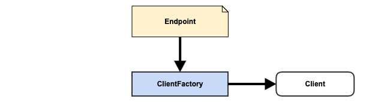

# Weave Extension Point - ClientFactory

## Quick Overview

### Definition

{ Endpoint, ClientFactory, Client }

### Diagram



### Extension Category Name

client-factory

### META-INF Template

META-INF/weave/extensions.json

```json
[
  {
    "baseType": "io.aftersound.weave.client.ClientFactory",
    "types": [
      "ClientFactory.implementation"
    ]
  }
}
```

### Applicable Scope

- services
- data loaders
- data processing pipelines

### Description

This extension point allows new database/data storage to be supported. 

- Endpoint, contains connection parameters to obtain client for target database/data storage system
- ClientFactory, acts on Endpoint and create client of target database/data storage system
- Client, client that could talk to target system, created by ClientFactory 

## Component Development Guide

Assume you'd like to make Weave to support a new type of data storage or database, called MyDB, and you want to create 
a component for that, here is how.

- start a Java project or use your existing project and create a new module
- include following 2 dependencies with scope *provided*, together with MyDB client SDK, in the pom of the module. Also 
make sure the pom asks for packaging jar with dependencies.

```xml
<groupId>io.xyz</groupId>
<artifactId>client-mydb</artifactId>
<version>1.0.0</version>

<dependencies>
    <dependency>
        <groupId>io.aftersound.weave</groupId>
        <artifactId>client-core</artifactId>
        <version>${weave.version}</version>
        <scope>provided</scope>
    </dependency>
    <dependency>
        <groupId>io.aftersound.weave</groupId>
        <artifactId>misc</artifactId>
        <version>${weave.version}</version>
        <scope>provided</scope>
    </dependency>
    <dependency>
        <groupId>mydb</groupId>
        <artifactId>mydbsdk</artifactId>
        <version>${mydbsdk.version}</version>
    </dependency>
</dependencies>
```

- create a class which extends DataClientFactory, together with facility classes

```java
package io.xyz.mydb;

import io.aftersound.weave.common.NamedType;
import io.aftersound.weave.dataclient.DataClientFactory;
import io.aftersound.weave.dataclient.DataClientRegistry;
import io.aftersound.weave.dataclient.Endpoint;
import MyDBClient;

public class MyDBClientFactory extends ClientFactory<MyDBClient> {
    
    // Must be included
    public static final NamedType<Endpoint> COMPANION_CONTROL_TYPE = NamedType.of(
        "MyDB",
        Endpoint.class
    );
    
    public static final NamedType<Object> COMPANION_PRODUCT_TYPE = NamedType.of(
        "MyDB", 
        MyDBClient.class
    );
    
    public MyDBClientFactory(ClientRegistry clientRegistry) {
        super(clientRegistry);
    }
    
    @Override
    protected MyDBClient createDataClient(Map<String, String> options) {
        // create MyDBClient with given options
    }
    
    @Override
    protected void destroyClient(MyDBClient client) {
        // shut down client
    }
    
}
```

- include a Weave extensions.json file under resources/META-INF/weave

```json
[
  {
    "baseType": "io.aftersound.weave.client.ClientFactory",
    "types": [
      "io.xyz.mydb.MyDBClientFactory"
    ]
  }
]
```
- compile, test, package, install, and deploy. Your component is ready to be installed into Weave deployment for 
integration test.
- install the component in Weave deployment for integration test purpose , and restart all Weave instances which have 
the component installed.
- if you want service runtime of Weave deployment to connect to a MyDB cluster, use data client config management service
to create a config.

```html
POST: http://WEAVE_INSTANCE:PORT/admin/data-client-config/create  
```

```json
{
  "type": "MyDB",
  "id": "mydb-client-123",
  "options": {
    "servers": "host1:port,host2:port",
  }
}
```
- Once Weave service runtime sees this config and it'll call MyDBClientFactory to create an instance of MyDBClient 
and place it into ClientRegistry. Any ServiceExecutor which understands MyDBClient can get hold of the instance of 
MyDBClient by following code.

```java
ClientRegistry dataClientRegistry = managedResources.getResource(
    ClientRegistry.class.getName(), 
    ClientRegistry.class
);

// assume ExecutionControl.myDBClientId is defined for this imagined ExecutionControl
MyDBClient client = dataClientRegistry.getClient(executionControl.getMyDBClientId());
```

- once tested, it's good to install it in production Weave deployment