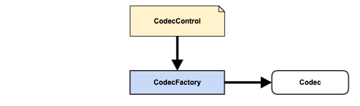

# Weave Extension Point - CodecFactory

## Quick Overview

### Definition

{ CodecControl, CodecFactory, Codec }

### Diagram



### Extension Category Name

codec-factory

### META-INF Template

META-INF/weave/extensions.json

```json
[
  {
    "baseType": "io.aftersound.weave.codec.CodecFactory",
    "types": [
      "CodecFactory Implementation"
    ]
  }
]
```

### Applicable Scope

- services
- data loaders
- data processing pipelines

### Description

CodecFactory is used for data codec, a.k.a, data encoding(serialization) and decoding(deserialization). 

This is more of a facility provided to services, data loaders, data processing pipelines to encode/decode data from/to 
target data containers.

- CodecControl, control which has unique type name and other options
- CodecFactory, a factory which will act upon CodecControl to create codec as specified
- Codec, a codec with an encoder that could encode from source to target and a decoder which decode encoded back to 
source type

## Component Development Guide

Assume you'd like to make Weave services/data loaders/data processing pipelines to support read/write data using java
serialization

- start a Java project or use your existing project and create a new module
- include following dependency with scope *provided*, in the pom of the module, together with other dependencies needed.
Also make sure the pom asks for packaging jar with dependencies.  

```xml

<groupId>io.xyz</groupId>
<artifactId>codec-java-class</artifactId>
<version>1.0.0</version>

<properties>
    <weave.version>0.0.1-SNAPSHOT</weave.version>
</properties>

<dependencies>
    <dependency>
        <groupId>io.aftersound.weave</groupId>
        <artifactId>codec-core</artifactId>
        <version>${weave.version}</version>
        <scope>provided</scope>
    </dependency>
</dependencies>

```
- create a class which extends Codec  

```java

package io.xyz.codec;

import io.aftersound.weave.common.NamedType;

import java.util.Collections;
import java.util.HashSet;
import java.util.List;
import java.util.Set;

public class JavaClassCodec<T> implements Codec<T, byte[]>, WithType<T> {
    
    private final Class<T> type;
    
    JavaClassCodec(Class<T> type) {
        this.type = type;
    }

    @Override
    public Encoder<T, byte[]> encoder() {
        // TODO
    }

    @Override
    public Decoder<byte[], T> decoder() {
        // TODO
    }
    
    @Override
    public Class<T> getType() {
        return type;
    }
    
}
```
- create a class which extends CodecControl  

```java

package io.xyz.codec;

import io.aftersound.weave.common.NamedType;

import java.util.Collections;
import java.util.HashSet;
import java.util.List;
import java.util.Set;

public class JavaClassCodecControl implements CodecControl {

    static final NamedType<CodecControl> TYPE = NamedType.of(
            "JavaClassCodec",
            CodecControl.class
    );

    @Override
    public String getType() {
        return TYPE.name();
    }
    
    private String javaClassName;
    
    public void setJavaClassName(String javaClassName) {
        this.javaClassName = javaClassName;
    }
    
    public String getJavaClassName() {
        return javaClassName;
    }
    
    @Override
    public String asCodecSpec() {
        return TYPE.name() + "(" + javaClassName + ")";
    }
}
```
- create a class which extends CodecFactory  

```java

package io.xyz.codec;

import io.aftersound.weave.common.NamedType;

import java.util.Collections;
import java.util.HashSet;
import java.util.List;
import java.util.Set;

public class JavaClassCodecFactory extends CodecControl {

    static final NamedType<String> COMPANION_CONTROL_TYPE = JavaClassCodecControl.TYPE;

    @Override
    public String getType() {
        return COMPANION_CONTROL_TYPE.name();
    }
    
    @Override
    public <S, E> Codec<S, E> createCodec(String codecSpec) {
        // create Codec in according to given codec spec
        String javaClassName = extractFromCodecSpec();
        return new JavaClassCodec(javaClassName);
    }

}
```

- include a Weave extensions.json file under resources/META-INF/weave  

```json

[
  {
    "baseType": "io.aftersound.weave.codec.CodecFactory",
    "types": [
      "io.xyz.codec.JavaClassCodecFactory"
    ]
  }
]


```
- compile, test, package, install, and deploy. Your component is ready to be installed into Weave deployment for 
integration test.
- install the component in Weave deployment for integration test purpose
- test it with service executor extension while can read/write data from/to somewhere
- once tested, it's good to install it in production Weave deployment