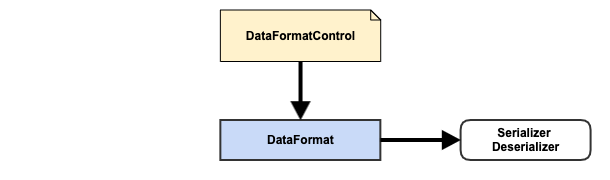

# Weave Extension Point - DataFormat

## Quick Overview

### Definition

{ DataFormatControl, DataFormat, Serializer/Deserializer }

### Diagram



### Extension Category Name

data-format

### META-INF Template

META-INF/data-format-extensions.json

```json
{
  "category": "data-format",
  "baseType": "io.aftersound.weave.data.DataFormat",
  "types": [
    "DataFormat.implementation"
  ]
}
```

### Applicable Scope

- service
- batch

### Description

DataFormat is used for data serialization/deserialization. 

This is more of a facility provided to ServiceExecutor/JobWorker implementation to deserialize/serialize data from/to target 
database/data storage system, so ServiceExecutor/JobWorker implementation doesn't have to implement its own.

- DataFormatControl, simple control which just carries type name
- DataFormat, represents a data format, such as JSON, Avro, etc.
- Serializer/Deserializer, serialize/deserializer for DataFormat

## Component Development Guide

Assume you'd like to make Weave Service/Batch Framework to support serving data, encoded in Smile format, out of Cassandra

- start a Java project or use your existing project and create a new module
- include following dependency with scope *provided*, in the pom of the module, together with other dependencies needed.
Also make sure the pom asks for packaging jar with dependencies.  

```xml

<groupId>io.xyz</groupId>
<artifactId>smile-data-format</artifactId>
<version>1.0.0</version>

<properties>
    <weave.version>0.0.1-SNAPSHOT</weave.version>
</properties>

<dependencies>
    <dependency>
        <groupId>io.aftersound.weave</groupId>
        <artifactId>weave-dataformat-core</artifactId>
        <version>${weave.version}</version>
        <scope>provided</scope>
    </dependency>
</dependencies>

<build>
    <plugins>
        <plugin>
            <groupId>org.apache.maven.plugins</groupId>
            <artifactId>maven-assembly-plugin</artifactId>
            <configuration>
                <archive/>
                <finalName>${project.artifactId}</finalName>
            </configuration>
            <executions>
                <execution>
                    <id>with-dependencies</id>
                    <configuration>
                        <appendAssemblyId>false</appendAssemblyId>
                        <descriptorRefs>
                            <descriptorRef>jar-with-dependencies</descriptorRef>
                        </descriptorRefs>
                        <finalName>${project.artifactId}-with-dependencies-${project.version}</finalName>
                    </configuration>
                    <phase>package</phase>
                    <goals>
                        <goal>single</goal>
                    </goals>
                </execution>
            </executions>
        </plugin>
    </plugins>
</build>
```
- create a class which extends DataFormat  

```java

package io.xyz.dataformat;

import io.aftersound.weave.common.NamedType;

import java.util.Collections;
import java.util.HashSet;
import java.util.List;
import java.util.Set;

public class SmileDataFormat implements DataFormat {

    static final NamedType<String> COMPANION_CONTROL_TYPE = NamedType.of(
            "Smile",
            String.class
    );

    @Override
    public String getType() {
        return COMPANION_CONTROL_TYPE.name();
    }

    @Override
    public Serializer serializer() {
        // TODO
    }

    @Override
    public Deserializer deserializer() {
        // TODO
    }

}
```

- include a Weave data-format-extensions.json file under resources/META-INF/weave  

```json

{
  "category": "data-format",
  "baseType": "io.aftersound.weave.data.DataFormat",
  "types": [
    "io.xyz.dataformat.SmileDataFormat"
  ]
}

```
- compile, test, package, install, and deploy. Your component is ready to be installed into Weave deployment for 
integration test.
- install the component in Weave deployment for integration test purpose , and restart all Weave instances which have 
the component installed.  

```html
http://WEAVE_INSTANCE:PORT/admin/service/extension/install?repository=maven://MAVEN_REPOSITORY_URL&groupId=io.xyz&artifactId=smile-data-format&version=1.0.0
```

- test it with service executor extension while can read data with Smile encoding from Cassandra

- once tested, it's good to install it in production Weave deployment