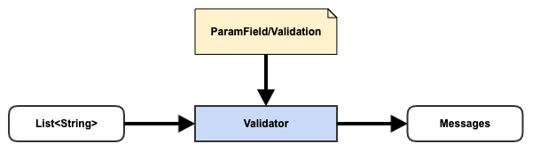

# Weave Extension Point - Validator

## Quick Overview

### Definition

{ Validation, Validator, Messages }

### Diagram



### Extension Category Name

param-validator

### META-INF Template

META-INF/weave/param-validator-extensions.json

```json
{
  "category": "param-validator",
  "baseType": "io.aftersound.service.request.Validator",
  "types": [
    "Validator.implementation"
  ]
}
```

### Applicable Scope

- service

### Description

This extension point allows new behavior of parameter validation to be supported

- ParamField/Validation, instructions on how to validate parameter
- Validator, validate parameter values in according to ParamField/Validation
- Messages, errors/warnings as output of Validator

## Component Development Guide
TODO