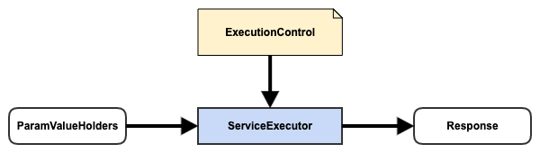

# Weave Extension Point - ServiceExecutor

## Quick Overview

### Definition

{ ExecutionControl, ServiceExecutor, Object }

### Diagram



### Extension Category Name

service-executor

### META-INF Template

META-INF/weave/service-executor-extensions.json

```json
{
  "category": "service-executor",
  "baseType": "io.aftersound.service.ServiceExecutor",
  "types": [
    "ServiceExecutor.implementation"
  ]
}
```

### Applicable Scope

- service

### Description

This extension point is for new metadata driven service executor

- ExecutionControl, controls how ServiceExecutor could/should serve request
- ServiceExecutor, serve request in forms of ParamValueHolders in according to ExecutionControl
- Object, effectively response out of request serving

## Component Development Guide

Assume you'd like to make Weave Service Framework to support service execution with Magic behavior

- start a Java project or use your existing project and create a new module
- include following dependency with scope *provided*, in the pom of the module, together with other dependencies needed.
Also make sure the pom asks for packaging jar with dependencies.  

```xml
<groupId>io.xyz</groupId>
<artifactId>magic-service-executor</artifactId>
<version>1.0.0</version>

<properties>
    <weave.version>0.0.1-SNAPSHOT</weave.version>
</properties>

<dependencies>
    <dependency>
        <groupId>io.aftersound.weave</groupId>
        <artifactId>weave-service-core</artifactId>
        <version>${weave.version}</version>
        <scope>provided</scope>
    </dependency>
</dependencies>

<build>
    <plugins>
        <plugin>
            <groupId>org.apache.maven.plugins</groupId>
            <artifactId>maven-assembly-plugin</artifactId>
            <configuration>
                <archive/>
                <finalName>${project.artifactId}</finalName>
            </configuration>
            <executions>
                <execution>
                    <id>with-dependencies</id>
                    <configuration>
                        <appendAssemblyId>false</appendAssemblyId>
                        <descriptorRefs>
                            <descriptorRef>jar-with-dependencies</descriptorRef>
                        </descriptorRefs>
                        <finalName>${project.artifactId}-with-dependencies-${project.version}</finalName>
                    </configuration>
                    <phase>package</phase>
                    <goals>
                        <goal>single</goal>
                    </goals>
                </execution>
            </executions>
        </plugin>
    </plugins>
</build>
```
- create a class which extends ExecutionControl  

```java
package io.xyz.service;

import io.aftersound.common.NamedType;
import io.aftersound.service.metadata.ExecutionControl;

public class MagicExecutionControl implements ExecutionControl {

    public static final NamedType<ExecutionControl> TYPE = NamedType.of(
            "Magic",
            MagicExecutionControl.class
    );

    @Override
    public String getType() {
        return TYPE.name();
    }
    
    // magic secrets
}
```
- create a class which extends ServiceExecutor, together with facility classes  

```java
package io.xyz.service;

import io.aftersound.common.NamedType;
import io.aftersound.service.ServiceContext;
import io.aftersound.service.ServiceExecutor;
import io.aftersound.service.metadata.ExecutionControl;
import io.aftersound.service.metadata.ServiceMetadata;
import io.aftersound.service.request.ParamValueHolder;
import io.aftersound.service.request.ParamValueHolders;
import io.aftersound.service.resources.ManagedResources;

import java.util.LinkedHashMap;
import java.util.Map;

public class MagicServiceExecutor extends ServiceExecutor {

    public static final NamedType<ExecutionControl> COMPANION_CONTROL_TYPE = MagicExecutionControl.TYPE;

    public MagicServiceExecutor(ManagedResources managedResources) {
        super(managedResources);
    }

    @Override
    public String getType() {
        return COMPANION_CONTROL_TYPE.name();
    }

    @Override
    public Object execute(ServiceMetadata serviceMetadata, ParamValueHolders request, ServiceContext context) {
        // validate serviceMetadata
        MagicExecutionControl executionControl = serviceMetadata.getExecutionControl();
        String magicName = request.firstWithName("magicName").signalValue(String.class);
        return playMagic(magicName, executionControl);
    }
    
    private MagicResponse playMagic(String magicName, MagicExecutionControl executionControl) {
        // play magic with secrets in execution control and return response
    }

}
```
- include a Weave service-executor-extensions.json file under resources/META-INF/weave  

```json
{
  "category": "service-executor",
  "baseType": "io.aftersound.service.ServiceExecutor",
  "types": [
    "io.xyz.service.MagicServiceExecutor"
  ]
}
```
- compile, test, package, install, and deploy. Your component is ready to be installed into Weave deployment for 
integration test.
- install the component in Weave deployment for integration test purpose , and restart all Weave instances which have 
the component installed.  

```html
http://WEAVE_INSTANCE:PORT/admin/service/extension/install?repository=maven://MAVEN_REPOSITORY_URL&groupId=io.xyz&artifactId=magic-service-executor&version=1.0.0
```
- next, create a service metadata in form of MagicExecutionControl  

```html
POST: http://WEAVE_INSTANCE:PORT/admin/service-metadata/create  
```
  
```json
{
  "id": "/magic-show",
  "paramFields": [
    {
      "name": "p1",
      "valueType": "String",
      "type": "Path",
      "multiValued": false,
      "constraint": {
        "type": "Required"
      }
    },
    {
      "name": "magicName",
      "valueType": "String",
      "type": "Query",
      "multiValued": false,
      "constraint": {
        "type": "Required"
      }
    }
  ],
  "executionControl": {
    "type": "Magic",
    "hat": "rabbitHidden"
  }
}
```
- Weave service runtime periodically scans for changes of service metadata, it'll see this service metadata and load it.
- Lastly, make a service call to verify if the service executor works as expected.  

```html
http://WEAVE_INSTANCE:PORT/magic-show?magicName=rabbit-in-a-hat
```
- once tested, it's good to install it in production Weave deployment