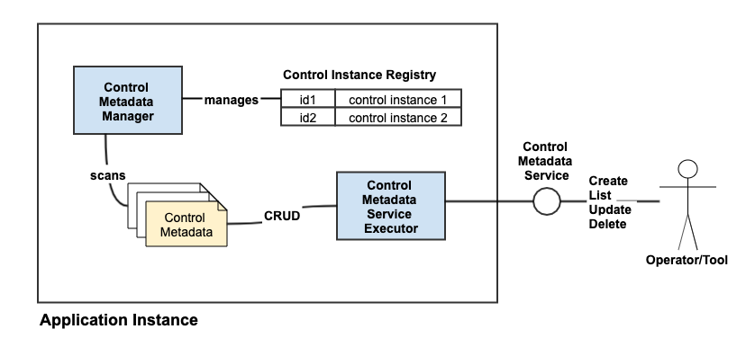

# Lifecycle Management under {CONTROL,ACTOR,PRODUCT} Component Structure

The [article](https://aftersound.github.io/weave/control-actor-product-component-structure) presents an component structure centered around 
{CONTROL,ACTOR,PRODUCT} and also a component micro-framework for stitching components at runtime. The effect, put in simple way, is 
- the component structure decouples
- while the micro-framework couples decoupled in a way to make application softer when change is needed.

This article tries to discuss how the component structure and associated micro-framework works from a different angle, lifecycle management.

Before going into details, let's list the entities whose life cycles would be managed.
- actor core and core package
- actor component and actor component package
- actor instance
- control metadata and control instance
- product instance
- entity virtualized over control instance plus actor instance

## Lifecycle of actor core and core package
In Weave, an actor core mainly consists of {ActorControl, Actor}, ActorProduct is optional. It is just an abstraction/concept in the form of 
Java interface or abstract class. Once written, compiled, built into package, no/little change is expected. Compared to other entities, 
actor core and core package are the most stable one. Of course, the assumption is the abstraction/concept is right and solid.

For actor core, its lifecycle goes through following phases,
- abstract
- code
- compile
- package

Simple and straightforward. 

Once packaged, things are all about lifecycle of core package, roughly,
- deployed
- referenced as dependency by either other actor core or application at higher level
- bundled into application package
- loaded at application runtime

Application, whose core is formed from a set of actor cores, tends to be stable and application package also tends to be stable, because 
actor cores are relatively stable.

## Lifecycle of actor component and actor component package
An actor component is implementation of actor core and its lifecycle consists of phases similar to actor core.  

- code implementation with actor core package as dependency
- compile
- package

For actor component package, it lifecycle in Weave involves,

- deployed
- installed as extension library of application and packaged actor component gets registered
- loaded in application runtime after application instances restart
- uninstalled/removed from extension, actor component get ejected from registration

Although it's not adopted by Weave, there is an alternative for actor component package.

- deployed
- bundled as dependency into application package, being directly or indirectly referenced
- loaded in application runtime 

However, above alternative is not recommended because actor component is less stable. A change in actor component will force a full dev/test
/release/deploy cycle of application. Meaning, application will be more rigid for change. 

## Lifecycle of actor instance
For registered actor component in Weave application, instance of its concrete actor is typically 
- instantiated when application starts
- destroyed when application stops

or  

- instantiated by a runtime entity at higher level
- destroyed when higher level runtime entity no longer needs it

## Lifecycle of control metadata and control instance
Control metadata is externalized control separated from binary package, typically in the form of JSON/YAML. Control metadata and control 
 instance has 1:1 relationship, and each control metadata uniquely identifies itself by identifier. Hence the lifecycle of control metadata 
 directly affects that of control instance.



- when control metadata is created by using control metadata management service, it's placed in designated metadata directory on file system 
where application could see.
- when it's visible to corresponding control metadata manager component, which periodically scans metadata directory. Control metadata 
 manager leverages type info in metadata and registered control class type to load and deserialize control metadata into control instance. 
 Control instance is live.
- when control metadata is updated with id remained, control metadata manager will create a new control instance to replace existing 
control instance. 
- when control metadata is deleted by using control metadata service, it'll be delete from metadata directory. Control metadata manager will
 remove corresponding control instance from runtime registry.
- control instance is pushed to actor instance by higher level runtime entity instead of letting actor instance to pull control instance.

You might notice that actor instance takes no responsibility in dealing with control metadata, and actor instance simply acts upon control 
instance pushed in, hence the full decoupling among control metadata, control instance, actor instance is achieved. Instead, Weave 
introduces additional two entities to manage the lifecycle of control metadata and control instance.
- control metadata management service, for CRUD control metadata(s). This provides operational flexibility, because changes of control 
metadata cannot be decided upfront.
- control metadata manager component, for managing control instances in according to visible control metadata(s).

## Lifecycle of product instance
Product instance is produced by actor instance under instruction of control instance. Its lifecycle is managed by enclosing runtime context. 
Here are two examples.
1. Concrete component of {CacheControl,CacheFactory,Cache} is used in service execution. The CacheControl instance is part
of ServiceMetadata instance, hence the Cache instance created by actor instance of CacheFactory lives as long as ServiceMetadata instance 
lives.
2. Concrete component of {ServiceMetadata/ExecutionControl,ServiceExecutor,Response} is use in service execution. A ServiceExecutor instance
 processes input request under instruction of ExecutionControl, and produces a Response, which lives very shortly.

## Lifecycle of entity virtualized by {control instance, actor instance}
The {CONTROL,ACTOR} in the component structure might creat virtualized entities. Let's dive into {ServiceMetadata/ExecutionControl,
ServiceExecutor,Response} to how entity virtualization happens and how virtualized entity's lifecycle looks like. 

Weave has one ServiceExecutor component for demo purpose, {ServiceMetadata/DemoExecutionControl, DemoServiceExecutor, Response}. What this 
demo service executor does is simply to respond parameters in request back. When Weave application sees DemoServiceExecutor type is in 
 registration, it'll instantiate an instance of DemoServiceExecutor. However there is no service available for client to call. Question now 
is how to create a demo service. Here is how, assuming there's a Weave instance running on localhost.

- try hit service endpoint to see what happens,

```html
GET: http://localhost/echo?q1=q1v1&q2=q2v1&q2=q2v2&q3=q3v1&q4=q4v1    
```

It is not available if Weave instance is running with bare core and DemoServiceExecutor component package installed as extension.

- create a service metadata JSON using service metadata management service call

```html
POST: http://localhost:8080/admin/service-metadata/create  
```

```json
{
  "id" : "/echo",
  "paramFields" : [ {
    "name" : "p1",
    "valueType" : "String",
    "type" : "Path",
    "multiValued" : false,
    "constraint" : {
      "type" : "Required"
    }
  }, {
    "name" : "q1",
    "valueType" : "String",
    "type" : "Query",
    "multiValued" : false,
    "constraint" : {
      "type" : "Required"
    }
  }, {
    "name" : "q2",
    "valueType" : "String",
    "type" : "Query",
    "multiValued" : true,
    "constraint" : {
      "type" : "Required"
    }
  }, {
    "name" : "q3",
    "valueType" : "String",
    "type" : "Query",
    "multiValued" : false,
    "constraint" : {
      "type" : "SoftRequired",
      "requiredWhen": {
        "otherParamNames": [
          "q4"
        ],
        "condition": "AllOtherNotExist"
      }
    }
  }, {
    "name" : "q4",
    "valueType" : "String",
    "type" : "Query",
    "multiValued" : false,
    "constraint" : {
      "type" : "SoftRequired",
      "requiredWhen": {
        "otherParamNames": [
          "q3"
        ],
        "condition": "AllOtherNotExist"
      }
    }
  }, {
    "name" : "d1",
    "valueType" : "String",
    "type" : "Derived",
    "multiValued" : false,
    "constraint" : {
      "type" : "Required"
    },
    "deriveControl": {
      "type": "Alias",
      "from": "q1"
    }
  }, {
    "name" : "d2",
    "valueType" : "String",
    "type" : "Derived",
    "multiValued" : true,
    "constraint" : {
      "type" : "Required"
    },
    "deriveControl": {
      "type": "Mapping",
      "from": "q2",
      "valueMapping": {
        "q2v1": "d1v1",
        "q2v2": "d1v2"
      }
    }
  }],
  "executionControl" : {
    "type" : "Demo"
  }
}
```

- wait for a few seconds
- try hit service endpoint again, a service should be available at path /echo

If you'd like to have a hands-on, try [Weave docker image](https://hub.docker.com/r/aftersound/weave) on your computer.

You might get a sense now,
- service executor is not a service or any service.
- service metadata itself is not a service, without an instance of ServiceExecutor can understand and act upon it.
- service is virtualized/materialized with {ServiceMetadata instance, ServiceExecutor instance}.

And naturally, more services can be created with multiple ServiceMetadata instances, while all of them are bound with same ServiceExecutor 
instance. 

In common practice of micro service development in Java, the binding between service interface (include path, request, response) and 
implementation is fixed, no matter it's through annotation or hard-coding. Below is one example of Spring Rest Service.

```java
@RestController
public class GreetingController {

    private static final String template = "Hello, %s!";
    private final AtomicLong counter = new AtomicLong();

    @RequestMapping("/greeting")
    public Greeting greeting(@RequestParam(value="name", defaultValue="World") String name) {
        return new Greeting(counter.incrementAndGet(),
                            String.format(template, name));
    }
}
```

There is nothing wrong with it, the thing is it's still rigid, IMHO. In some scenarios, service application needs to be softer when changes 
are needed. Building services through virtualization is more powerful way, because it can boost engineering efficiency and consistency with 
regard to building and operating services. 

## Summary
This article goes though the list of entities involved in {CONTROL,ACTOR,PRODUCT} component structure, and it also roughly describes how 
each of their lifecycle works in Weave application. From angle of lifecycle management, hopefully it's better understood how this component 
structure can help creating an application which is highly extensible and highly declarative (metadata driven).
