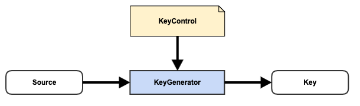

# Micro-service Virtualization over { CONTROL, ACTOR, PRODUCT } - Closer Look

(Before anything, let's make CAP = { CONTROL, ACTOR, PRODUCT }.)

The article [Micro-service Virtualization over CAP](https://aftersound.github.io/weave/micro-service-virtualization-over-service-executor-components) 
gives an example to illustrate how micro-service virtualization works in Weave on the surface, it's time to take a closer look into the core of service framework centered around [CAP component structure](https://aftersound.github.io/weave/control-actor-product-component-structure).

## High Level View

Let's start from the high level view of single Weave instance.


At high level, the service part (yes, it can also run batch job) of each Weave instance consists of 3 layers,
- at the bottom, it's the runtime of Weave Service Framework Core which is centered around a set of CAP core concepts.
- on top of framework core runtime, runs a layer of extension components, each implements one CAP extension point.
- at the top layer, runs micro services virtualized/realized by service metadata (s)

With that, let's move on to quickly walk through service extension points, which makes service framework extremely 
extensible and also makes service virtualization possible.

## Service Extension Points

### 1. {Endpoint, DataClientFactory, DataClient}


- Endpoint, contains connection parameters to obtain data client for target database/data storage system
- DataClientFactory, acts on Endpoint and create data client of target database/data storage system
- DataClient, data client created by DataClientFactory

### 2. {ParamFields, ParameterProcessor, ParamValueHolders}


- ParamFields, definition of parameter fields, which is typically part of visible interface of micro service
- ParameterProcessor, validate and process request in according to ParamFields
- ParamValueHolders, output of ParameterProcessor, which is better structured for easy access

### 3. {Validation, Validator, Messages}


It cannot be pre-determined with regard to when and how to validate a parameter. 

- Validation, instructions on how to validate a parameter
- Validator, validate a parameter in according to instructions in Validation
- Messages, errors/warnings as output of Validator

### 4. {DeriveControl, Deriver, ParamValueHolder}


Often, though not always, there is need to derive a parameter from another parameter in request. 

- DeriveControl, instructions on how to derive a ParamValueHolder from another
- Deriver, derive a ParamValueHolder from another under the instructions in DeriveControl
- ParamValueHolder, derived ParamValueHolder

### 5. {CacheControl, CacheFactory, Cache}


Cache is very common solution for speeding up slow services.

- CacheControl, instructions on how a Cache should be created and its behavior
- CacheFactory, creates Cache in according to CacheControl
- Cache, created by CacheFactory

### 6. {KeyControl, KeyGenerator, Key}


This extension is for generating cache key for service response

- KeyControl, instructions on how a cache key should be generated
- KeyGenerator, generate cache key in according to KeyControl
- Key, cache key created by KeyGenerator

### 7. {AuthenticationControl, Authenticator, Authentication}


Micro services often need to be secured, first level of security is to make sure client is legitimate.

- AuthenticationControl, instructions on how authentication should be conducted
- Authenticator, acts on AuthenticationControl to authenticate token/credential bearer
- Authentication, result of authentication conducted by Authenticator 

### 8. {AuthorizationControl, Authorizer, Authorization}


Sometime, it's not enough to just know the client is legit, it's also important to make sure the client has the right 
privilege.

- AuthorizationControl, instructions on how authorization check should be conducted
- Authorizer, conduct authorization check in according to AuthorizationControl
- Authorization, result of authorization check

### 9. {ExecutionControl, ServiceExecutor, Response}


This is the most important extension point. 

- ExecutionControl, controls how ServiceExecutor could/should serve request
- ServiceExecutor, serve request in forms of ParamValueHolders in according to ExecutionControl
- Response, response of request serving

### 10. {DataFormatControl, DataFormat, Serialzer/Deserializer}


This is more of a facility provided to ServiceExecutor implementation to deserialize/serialize data from/to target 
database/data storage system, so ServiceExecutor implementation doesn't have to implement its own.

- DataFormatControl, simple control which just carries type name
- DataFormat, represents a data format, such as JSON, Avro, etc.
- Serializer/Deserializer, serialize/deserializer for DataFormat

## Service Framework in action

[Lifecycle Management under CAP Component Structure](https://aftersound.github.io/weave/lifecycle-management-under-cap-component-structure) 
offers a general explanation on how extension libiraries, extension components, controls, control metadata, etc. are 
managed. It's highly recommended to read it if you haven't, since that article covers some mechanism while this does not.

### Initialization

Before a Weave instance could serve any request, it needs to be properly initialized. Just like boot process of a 
modern operating system has several stages, Weave service initialization has more than 1 phase, each phase has a purpose
 for next phase to be successful.

#### Phase 1


In phase 1, initializer of service framework does a simple job, load and create actor bindings of extension components. 
More specifically, it 
- reads extension point specific types json files, each holds registered actor types of components for corresponding 
extension point.
- loads actor implementation classes
- reads companion control type and product type from every actor implementation class
- binds { actor type, control type, product type } for all registered components.

Although it's simple, it does critical preparation for next phase.

### Phase 2 - stitch and init data client runtime core

In phase 2, there is an initialization step which creates and stitches several components to form data client runtime 
core.  


  
- creates a DataClientConfigReader, which is responsible for reading/deserializing JSON/YAML files into Endpoint 
objects.
- creates a DataClientRegistry, which itself consumes DataClientFactory bindings to create stateless instances of 
DataClientFactory implementation and maintain a mapping between type name and instance, also it has a registry which 
holds data client created by DataClientFactory
- creates DataClientManager, which has a worker daemon. Once the daemon is started, it monitors Endpoint JSON/YAML files
 over the life time of Weave instance,  uses DataClientConfigReader to read changes of Endpoint(s), then delegate to 
 DataClientRegistry to initialize/destroy and register/unregister data clients accordingly.
 
DataClientRegistry is made available to ServiceExecutor instances, so they could get hold of data client objects of 
interests to access data in target database/data storage systems by providing a simple identifier.

### Phase 2 - stitch and init service execution runtime core

Phase 2 has another step which is relatively complex, which creates and stitches multiple components to form service 
execution runtime core.  


The initializer 

- creates a ServiceExecutorFactory, which itself consumes actor types in ServiceExecutor bindings to create stateless 
instances of ServiceExecutor implementations and maintains a mapping between type and ServiceExecutor instance.

- creates a ServiceMetadataReader, which is aware of control types available in actor bindings loaded in phase 1. With 
control types, it has the ability to read/deserialize controls of concrete implementations, which might be referenced 
in ServiceMetadata JSON/YAML.

- creates a CacheRegistry, which consumes actor types available in CacheFactory bindings to create stateless instances of 
CacheFactory implementations and maintains a mapping between type and CacheFactory instance, it also maintain a registry 
which holds caches created by CacheFactory.

- creates an ActorRegistry<KeyGenerator>. ActorFactory consumes actor types available in KeyGenerator bindings to 
create a registry of stateless instances of installed KeyGenerator implementations, each associated with a unique type 
name.

- creates a ServiceMetadataManager, which has a daemon worker. Once the daemon is started, it monitors ServiceMetadata 
JSON/YAML files over the life time of Weave instance, uses ServiceMetadataReader to read changes of ServiceMetadata(s). 
If a ServiceMetadata has CacheControl, it'll delegate to CacheRegistry to initialize/destroy and register/unregister 
Caches. ServiceMetadataManager also maintains a registry of ServiceMetadata(s) for request-serving-time access.

- creates an ActorRegistry<Authenticator>. ActorFactory consumes actor types of Authenticator bindings to create a 
registry of stateless instances of installed Authenticator implementations, each associated with a unique type name.

- creates an ActorRegistry<Authorizer>. ActorFactory consumes actor types of Authorizer bindings to create a registry
 of stateless instances of installed Authorizer implementations, each associated with a unique type name.

- creates a SecurityControlRegistry, which provides access to ServiceMetadata level SecurityControl from attached 
ServiceMetadataManager.

- creates a WeaveAuthFilter and hook it into Java Servlet Filter chain. WeaveAuthFilter is stitched with 
SecurityControlRegistry, ActorRegistry<Authenticator> and ActorRegistry<Authorizer>.

- create an ActorRegistry<Validator>. ActorFactory consumes actor types in Validator bindings to create a registry of 
stateless instances of installed Validator implementations, each associated with a unique type name.

- create an ActorRegistry<Deriver>. ActorFactory consumes actor types in Deriver bindings to create a registry of 
stateless instances of installed Deriver implementations, each associated with a unique type name.

- creates a ParameterProcessor, which has visibility of both ActorRegistry<Validator> and ActorRegistry<Deriver> in 
order to do its job.

- creates an ActorRegistry<DataFormat>. ActorFactory consumes actor types of DataFormat bindings to create a registry 
of stateless instances of installed DataFormat implementations, each associated with a unique type name. 
ActorRegistry<DataFormat> is made available to any ServiceExecutor which is interested in using DataFormat to 
serialize/deserialize data.

### Request Serving

Now initialization is done, Weave instance has the proper service runtime core for service virtualization and taking 
requests. 

Weave Service Framework core runs inside Java Servlet container, a request serving involves filter and controller.

#### Authentication and Authorization
Weave service authentication and authorization is handled through filter. The diagram below should be self-explanatory.


 

#### Service Controller
Once filter phase is passed, request handling control is handed over to service controller. The diagram below should 
be self-explanatory.


## Micro-service Virtualization through ServiceMetadata

If you revisit the example 
mentioned in 
[Micro-service Virtualization over CAP](https://aftersound.github.io/weave/micro-service-virtualization-over-service-executor-components)
, combined with what has been illustrated/described in this article, you might have got a deeper understanding on how 
micro-service virtualization through ServiceMetadata works in Weave. Hopefully!

Now let's look into the structure of ServiceMetadata and what each part is for.

### Structure of ServiceMetadata


- path
  - the path of micro-service
  - uniquely identify itself to service framework core
- ParamFields
  - definition of parameter fields of micro-service
  - used by service framework core and ParameterProcessor to parse, process and validate request
- ExecutionControl
  - its type name is used by service framework core to deserialize ExecutionControl object of right type from JSON/YAML 
  - its type name is also used by service framework core to identify the right ServiceExecutor
  - served as instruction for chosen ServiceExecutor to act upon when serving request
- CacheControl  
  - concerning service response cache handling, which is optional and orthogonal to peer controls
- SecurityControl  
  - concerning security of micro-service, which is optional and orthogonal to peer controls
  - SecurityControl.AuthenticationControl, its type name is used by WeaveAuthFilter to identify the right Authenticator 
  and rest is instruction for chosen Authenticator to act upon when conducting authentication
  - SecurityControl.AuthorizationControl, its type name is used by WeaveAuthFilter to identify the right Authorizer 
  and rest is instruction for chosen Authorizer to act upon when conducting authorization check
  
Further analyze ServiceMetadata,
- id/ParamFields largely defines service interface visible to clients once micro-service is realized
- ServiceMetadata binds micro-service interface and implementation in a declarative manner, YAML/JSON is just textual 
representation
- Most importantly, ServiceMetadata is effectively control composite, a control for Weave Service Framework core to act 
upon
  - expose service interface defined by id/ParamFields
  - make sure client would be authenticated/authorized as instructed by SecurityControl
  - process service request in according to ParamFields
  - serve processed/validated service request in according to ExecutionControl
  - handle response cache based on CacheControl

### Example of ServiceMetadata
  
```json
{
  "path": "/beer-sample/brewer",
  "paramFields": [
    {
      "name": "p1",
      "valueType": "String",
      "type": "Path",
      "multiValued": false,
      "constraint": {
        "type": "Required"
      }
    },
    {
      "name": "p2",
      "valueType": "String",
      "type": "Path",
      "multiValued": false,
      "constraint": {
        "type": "Required"
      }
    },
    {
      "name": "id",
      "valueType": "String",
      "type": "Query",
      "multiValued": false,
      "constraint": {
        "type": "Required"
      }
    }
  ],
  "executionControl": {
    "type": "Couchbase",
    "repository": {
      "id": "cluster.test.beer-sample",
      "getControl": {
        "timeout": 50
      }
    },
    "byKey": {
      "keyTemplate": "@{id}",
      "schemaSelector": "default",
      "schemas": {
        "default": {
          "format": "JSON",
          "schema": "io.aftersound.weave.schema.samples.Brewery"
        }
      }
    }
  },
  "securityControl": {
    "authenticationControl": {
      "type": "DemoAuthentication"
    }
  }
}
```
  
## Conclusion

The article provides a closer/in-depth look into how Weave Service Framework works, 
- how the component structure CAP is fully embraced and leveraged to make service framework 
extensible and declarative.
- how service virtualization is achieved through ServiceMetadata, a composite of controls of separate concerns.

Hope you enjoy it! 

## Last but not the least

Weave is open source and there are a lot ToDo to make it useful.

[Weave Framework Core ToDo](https://github.com/aftersound/weave/blob/master/TODO.md)  
[Weave Extensions ToDo](https://github.com/aftersound/weave-managed-extensions/blob/master/TODO.md)

All contributions are welcome!
