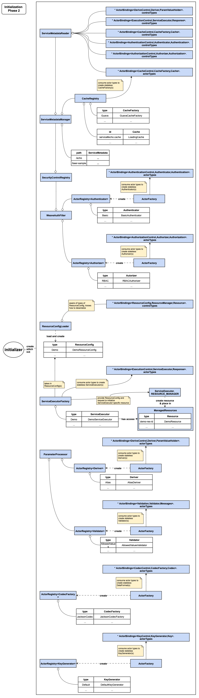

# Micro-service Virtualization over { CONTROL, ACTOR, PRODUCT } - Closer Look

The article [Micro-service Virtualization over { CONTROL, ACTOR, PRODUCT }](https://aftersound.github.io/weave/micro-service-virtualization-over-service-executor-components) 
gives an example to illustrate how micro-service virtualization works in Weave, it's time to take a closer look at key 
parts of the service framework core centered around [{ CONTROL, ACTOR, PRODUCT } component structure](https://aftersound.github.io/weave/control-actor-product-component-structure).

## High Level View

Before the closer look, let's have a high level view of single Weave instance.


At high level, it consists of 3 layers,
- at the bottom, it's Weave Service Framework Core runtime which is centered around a set of {CONTROL, ACTOR, PRODUCT}
core.
- on top of framework core runtime, runs a layer of extension components, each implements one {CONTROL, ACTOR, PRODUCT}
extension point.
- at the top layer, runs micro services virtualized/realized by service metadata (s)

With that, let's move on to quickly walk through service extension points, which makes service framework extremely 
extensible and also makes service virtualization possible.

## Service Extension Points

### 1. {Endpoint, DataClientFactory, DataClient}


- Endpoint, contains connection parameters to obtain data client for target database/data storage system
- DataClientFactory, acts on Endpoint and create data client of target database/data storage system
- DataClient, data client created by DataClientFactory

### 2. {ParamFields, ParameterProcessor, ParamValueHolders}


- ParamFields, definition of parameter fields, which is typically part of visible interface of micro service
- ParameterProcessor, validate and process request in according to ParamFields
- ParamValueHolders, output of ParameterProcessor, which is better structured for easy access

### 3. {DeriveControl, Deriver, ParamValueHolder}


Often, though not always, there is need to derive a parameter from another parameter in request. 

- DeriveControl, instructions on how to derive a ParamValueHolder from another
- Deriver, derive a ParamValueHolder from another under the instructions in DeriveControl
- ParamValueHolder, derived ParamValueHolder

### 4. {CacheControl, CacheFactory, Cache}


Cache is very common solution for speeding up slow services.

- CacheControl, instructions on how a Cache should be created and its behavior
- CacheFactory, creates Cache in according to CacheControl
- Cache, created by CacheFactory

### 5. {AuthenticationControl, Authenticator, Authentication}


Micro services need protection, first level is to make sure client is legitimate.

- AuthenticationControl, instructions on how authentication should be conducted
- Authenticator, acts on AuthenticationControl to authenticate token/credential bearer
- Authentication, result of authentication conducted by Authenticator 

### 6. {AuthorizationControl, Authorizer, Authorization}


Sometime, it's not enough to just know the client is legit, it's important to make sure client has the right privilege.

- AuthorizationControl, instructions on how authorization check should be conducted
- Authorizer, conduct authorization check in according to AuthorizationControl
- Authorization, result of authorization check

### 7. {ExecutionControl, ServiceExecutor, Response}


This is the most important extension point. 

- ExecutionControl, controls how ServiceExecutor could/should serve request
- ServiceExecutor, serve request in forms of ParamValueHolders in according to ExecutionControl
- Response, response of request serving

## Service Framework in action

[Lifecycle Management under {CONTROL,ACTOR,PRODUCT} Component Structure](https://aftersound.github.io/weave/lifecycle-management-under-cap-component-structure) 
offers a general explanation on how extension components, controls, control metadata, etc. are managed. It's highly 
recommended to read it if you haven't, since it covers some mechanism which won't be described in this doc.

### Initialization

Before a Weave instance could serve any service, it needs to be properly initialized. Just like boot process of a 
modern operating system has several stages, Weave service initialization has more than 1 phase, each phase has its own 
purpose and each phase needs to be successful in order for next phase to do its job.

#### Phase 1


In phase 1, initializer of service framework does a simple job, load and create actor bindings of extension components. 
More specifically, it 
- reads extension point specific types json files, each holds registered actor types of components for corresponding 
extension point.
- loads actor implementation classes
- reads companion control type and product type from every actor implementation class
- binds { actor type, control type, product type } for all registered components.

Although it's simple, it does critical preparation for next phase.

### Phase 2 - stitch and init data client runtime core


In phase 2, there is an initialization step which creates and stitches several components to form data client runtime core.

- creates a DataClientConfigReader, which is responsible for reading/deserializing JSON/YAML files into Endpoint 
objects.
- creates a DataClientRegistry, which itself consumes DataClientFactory bindings to create stateless instances of 
DataClientFactory implementation and maintain a mapping between type name and instance, also it has a registry which 
holds data client created by DataClientFactory
- creates DataClientManager, which has a worker daemon. Once the daemon is started, it monitors Endpoint JSON/YAML files
 over the life time of Weave instance,  uses DataClientConfigReader to read changes of Endpoint(s), then delegate to 
 DataClientRegistry to initialize/destroy and register/unregister data clients accordingly.
 
DataClientRegistry is made available to ServiceExecutor instances, so they could get hold of data client objects of 
interests to access data in target database/data storage systems.

### Phase 2 - stitch and init service execution runtime core


Phase 2 has a step which is relatively complex, which creates and stitches multiple components to form service 
execution runtime core. The initializer 

- creates a ServiceExecutorFactory, which itself consumes actor types in ServiceExecutor bindings to create stateless 
instances of ServiceExecutor implementations and maintains a mapping between type and ServiceExecutor instance.

- creates a ServiceMetadataReader, which is aware of control types available in actor bindings loaded in phase 1. It has 
the ability to read/deserialize controls of concrete implementations, which might be referenced in ServiceMetadata JSON/
YAML.

- creates a CacheRegistry, which consumes actor types available in CacheFactory bindings to create stateless instances of 
CacheFactory implementations and maintains a mapping between type and CacheFactory instance, also maintain a registry 
which holds caches created by CacheFactory.

- creates a ServiceMetadataManager, which has a daemon worker. Once the daemon is started, it monitors ServiceMetadata 
JSON/YAML files over the life time of Weave instance, uses ServiceMetadataReader to read changes of ServiceMetadata(s). 
If a ServiceMetadata has CacheControl, it'll delegate to CacheRegistry to initialize/destroy and register/unregister 
Caches. ServiceMetadataManager also maintains a registry of ServiceMetadata(s) for request-serving-time access.

- creates an AuthenticatorFactory, which consumes actor types of Authenticator bindings to create stateless instances of
Authenticator implementations and maintains a mapping between type and Authenticator instance.

- creates an AuthorizerFactory, which consumes actor types of Authorizer bindings to create stateless instances of 
Authorizer implementations and maintains a mapping between type and Authorizer instance.

- creates a SecurityControlRegistry, which provides access to SecurityControl from attached ServiceMetadataManager.

- creates a WeaveAuthFilter and hook it into Java Servlet Filter chain. WeaveAuthFilter is stitched with 
SecurityControlRegistry, AuthenticatorFactory and AuthorizerFactory.

- create a DeriverFactory, which consumes actor types in Deriver bindings to create stateless instances of Deriver 
implementations and maintains a mapping between type and Deriver instance.

- creates a ParameterProcessor, which has visibility of DeriverFactory.

### Request Serving

Now initialization is done, Weave instance has the proper service runtime core for service virtualization and taking 
requests. 

Weave Service Framework core runs inside Java Servlet container, a request serving involves filter and controller.

#### Authentication and Authorization


Weave service authentication and authorization is handled through filter. The above diagram should be self-explanatory. 

#### Service Controller


Once filter phase is passed, request handling control is handed over to service controller. The above diagram should 
be self-explanatory.

## Micro-service Virtualization through ServiceMetadata

You've read this far. Hopefully, you've got a fairly good idea on how it works. Revisiting the example 
mentioned in 
[Micro-service Virtualization over { CONTROL, ACTOR, PRODUCT }](https://aftersound.github.io/weave/micro-service-virtualization-over-service-executor-components)
, you might get a deeper understanding of micro-service virtualization through ServiceMetadata in Weave.

### Structure of ServiceMetadata


- id/path and paramFields defines visible interface from client perspective
- with ParamFields, Service Framework core is able to parse, process and validate parameters in request. ServiceExecutor
takes no/little responsibility of process parameters in request.
- ExecutionControl, its type is the only information that framework core cares about to determine which ServiceExecutor
 to use, rest information is for chosen ServiceExecutor instance to act upon.
- CacheControl, concerning service response cache handling, which is optional and orthogonal to peer controls.
- SecurityControl, concerning authentication and authorization, which is again optional and orthogonal to other peer 
controls.

As a matter of fact, ServiceMetadata is effectively control composite. You might have also noticed, ServiceMetadata 
declaratively binds interface and implementation.

### Example of ServiceMetadata
  
```json
{
  "id": "/beer-sample/brewer",
  "paramFields": [
    {
      "name": "p1",
      "valueType": "String",
      "type": "Path",
      "multiValued": false,
      "constraint": {
        "type": "Required"
      }
    },
    {
      "name": "p2",
      "valueType": "String",
      "type": "Path",
      "multiValued": false,
      "constraint": {
        "type": "Required"
      }
    },
    {
      "name": "id",
      "valueType": "String",
      "type": "Query",
      "multiValued": false,
      "constraint": {
        "type": "Required"
      }
    }
  ],
  "executionControl": {
    "type": "Couchbase",
    "repository": {
      "id": "cluster.test.beer-sample",
      "getControl": {
        "timeout": 50
      }
    },
    "byKey": {
      "keyTemplate": "@{id}",
      "schemaSelector": "default",
      "schemas": {
        "default": {
          "format": "JSON",
          "schema": "io.aftersound.weave.schema.samples.Brewer"
        }
      }
    }
  },
  "securityControl": {
    "authenticationControl": {
      "type": "DemoAuthentication"
    }
  }
}
```
  
## Conclusion

The article provides a closer/in-depth look into how Weave Service Framework works, 
- how the component structure { CONTROL, ACTOR, PRODUCT } is fully embraced and leveraged to make service framework 
extensible and declarative.
- how service virtualization is achieved over ServiceMetadata, a composite of controls of separate concerns.

Hope you enjoy it! 

## Last but not the least

Weave is open source and there are a lot ToDo to make it useful.

[Weave Framework Core ToDo](https://github.com/aftersound/weave/blob/master/TODO.md)  
[Weave Extensions ToDo](https://github.com/aftersound/weave-managed-extensions/blob/master/TODO.md)

Contribution are welcome!